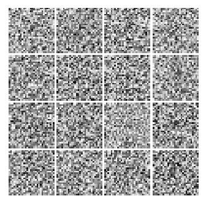
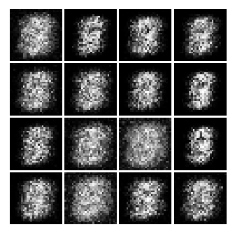
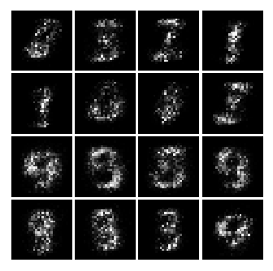
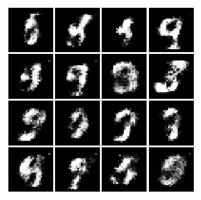
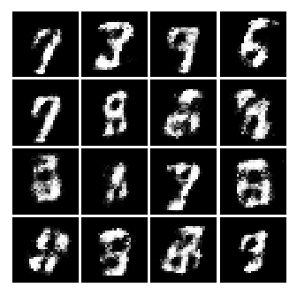

# Generative Adversarial Nets (GAN) for MNIST
TensorFlow implementation of "Generative Adversarial Nets" that generates images of handwritten digits.<br>

## Requirements
* Python 3.5
* TensorFlow 0.12
* NumPy
* Matplotlib

## Usage
#### Clone the repository
```bash
$ git clone https://github.com/hayago/generative-adversarial-nets-mnist.git
$ cd gan-tensorflow-mnist
```

#### Execute
```bash
$ python gan.py
```

## Result
#### 0 iterations


#### 20,000 iterations


#### 40,000 iterations


#### 80,000 iterations


#### 120,000 iterations

<br>

## References
1. [Generative Adversarial Nets](https://arxiv.org/abs/1406.2661)
2. [Agustinus Kristiadi's Blog](http://wiseodd.github.io/techblog/2016/09/17/gan-tensorflow/)
